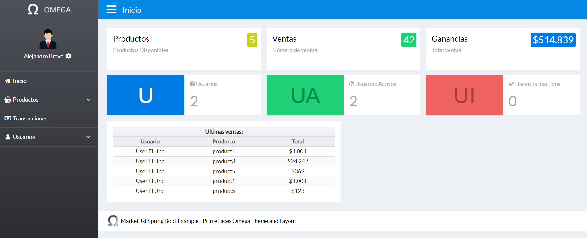
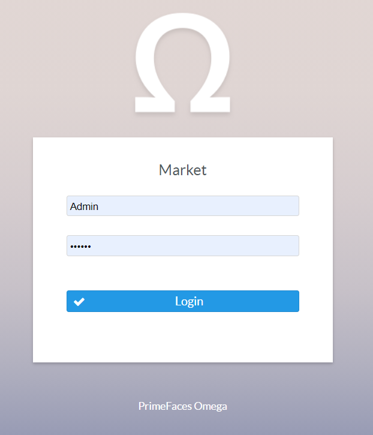
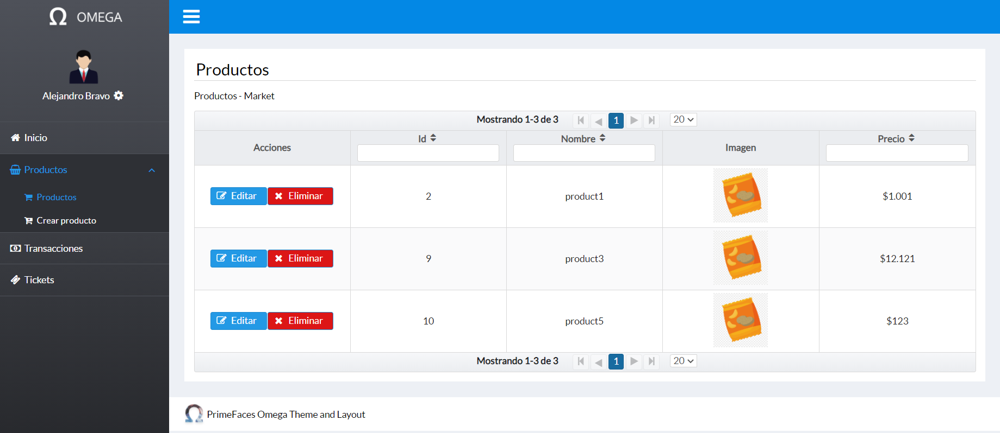
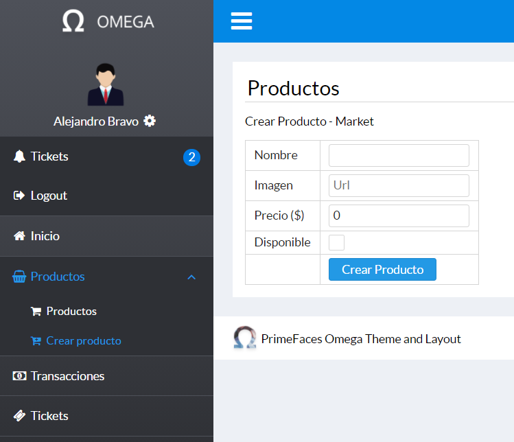
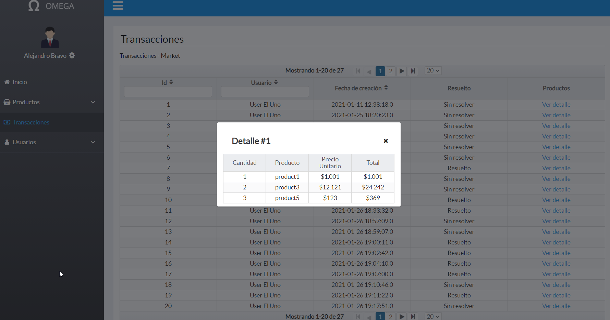
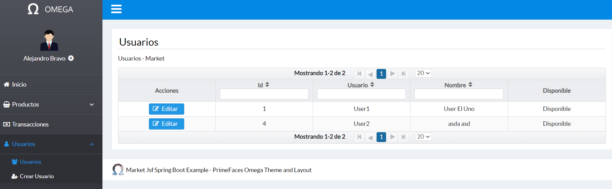
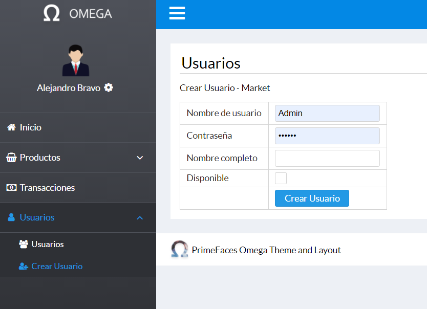

<!-- PROJECT LOGO -->
<br />
<p align="center">
  

  <h3 align="center">Market Example</h3>

  <p align="center">
    Example of ecommerce platform with Spring Boot and Primefaces.
    <br />
    <br />
    <!--<a href="">View Demo </a>-->
  </p>
</p>

<!-- TABLE OF CONTENTS -->
<details open="open">
  <summary>Table of Contents</summary>
  <ol>
    <li>
      <a href="#about-the-project">About The Project</a>
      <ul>
        <li><a href="#built-with">Built With</a></li>
      </ul>
    </li>
    <li>
      <a href="#getting-started">Getting Started</a>
      <ul>
        <li><a href="#installation">Installation</a></li>
      </ul>
    </li>
    <li><a href="#images">Images</a></li>
    <li><a href="#license">License</a></li>
    <li><a href="#contact">Contact</a></li>
  </ol>
</details>


<!-- ABOUT THE PROJECT -->
## About The Project



This project contemplates the creation of two applications:

(In Progress) Online store (app-market):
- It must show the products created in the dashboard.
- You must allow payment through the OneClick api. (dev environment).
- It must allow the creation of users.

(Done!) Dashboard (app-dashboard):
- The login must be restricted to admin users. ✓
- Must have a product maintainer.  ✓
- Must have a transaction maintainer. ✓
- You must have a user maintainer. ✓

### Built With

* Java 8
* Spring boot 2.3.0
* Primefaces 8.0
* Maven

<!-- GETTING STARTED -->
## Getting Started

In order to deploy the project it is necessary to execute the following previous steps.

### Installation

The omega-menu-2.0.1.jar file must be installed using the following command in the app-dashboard project folder.
* mvn
  ```sh
  mvn install:install-file -Dfile=omega-menu-2.0.1.jar -DgroupId=org.primefaces.omegamenu -DartifactId=omega-menu -Dversion=2.0.1 -Dpackaging=jar
  ```

<!-- USAGE EXAMPLES -->
## Images
  
 
 


<!-- LICENSE -->
## License
If you want to use the dashboard template in your own project, you must buy the license at the following link:
https://www.primefaces.org/layouts/omega

This readme was created from the following template:

https://github.com/othneildrew/Best-README-Template


<!-- CONTACT -->
## Contact

Alejandro Bravo Cáceres - al.bravoc68@gmail.com
